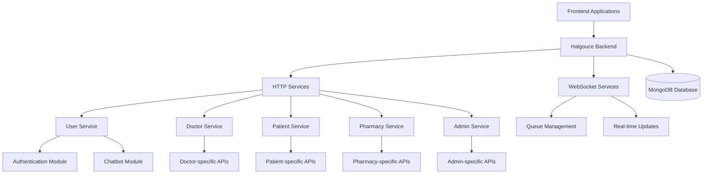

# 🏢 Halgouce Backend

> Advanced healthcare consultation system built with Ballerina

[](https://ballerina.io/)
[](https://www.mongodb.com/)

A modular backend platform designed to streamline healthcare consultations by managing doctors, patients, appointments,pharmacies, prescriptions, and reporting, with secure role-based access control and real-time notifications.

---

## 📋 Table of Contents

- [Features](#features)
- [Architecture](#architecture)
- [Modular Design](#modular-design)
- [API Documentation](#api-documentation)
- [Modules](#modules)
- [Configuration](#configuration)
- [Quick Start](#quick-start)
- [Development](#development)
- [Project Structure](#project-structure)
- [Team](#team)
- [Support](#support)

---

## ✨ Features

### 🏢 **Core Functionality**
- **User Management** – Role-based accounts and secure authentication  
- **Doctor Management** – Registration, specialization, schedule, and availability handling  
- **Patient Management** – Profiles with medical history, records, and personal details  
- **Pharmacy Management** – Prescription tracking, medicine dispensing 
- **Appointment Scheduling** – Real-time booking, rescheduling, and cancellation with conflict checks  
- **Consultations** – Virtual and in-person consultations with reports & prescriptions  
- **Medical Records** – Doctor-issued prescriptions with secure download support  
- **Medical History** – Centralized access to past consultations and treatments  
- **Queue Management** – Real-time queue tracking and updates using WebSocket-based system  
- **Reception Agent Chatbot** – Powered by *LLaMA 405B Instruct (free model)*, capable of handling:  
  - General queries  
  - Hospital database queries  
  - Website assistance & navigation  
- **Dashboard & Analytics** – Real-time insights and reporting for both doctors and admins  

---

### 🔐 **Security & Authentication**
- **JWT Authentication** – Secure token-based authentication  
- **Role-Based Access Control (RBAC)** – Roles for Admin, Doctor, Patient, and Pharmacy  
- **Password Hashing** – Encrypted storage of user credentials  
- **CORS Support** – Cross-origin resource sharing configuration  
- **Data Privacy** – Strict security measures for protecting sensitive health information  

---

## 🏗️ Architecture


---
### 📦 **Modular Design**
- **Independent Services** – Each feature implemented as a separate module  
- **Shared Dependencies** – Common utilities and centralized database access  
- **Dynamic Functions** – Reusable function components for efficiency  
- **Scalable Architecture** – Designed for easy extension and maintenance  
- **RESTful APIs** – Standardized HTTP endpoints following REST principles  
---


## 📚 API Documentation

### 🌐 **Service Endpoints**

| Service              | Base URL     | Port  | Description |
|-----------------------|-------------|-------|-------------|
| 👥 User Service       | `/user`     | 8080  |Handle user authentication (login, registration, password reset, OTP verification & chatBot)  |
| 🧑‍⚕️ Doctor Service   | `/doctor`   | 8080  | Manage doctor profiles, schedules, and availability |
| 🏥 Patient Service    | `/patient`  | 8080  | Manage patient records, medical history, and appointments |
| 💊 Pharmacy Service   | `/pharmacy` | 8080  | Manage pharmacies and prescription fulfillment |
| 🛡️ Admin Service      | `/admin`    | 8080  | System-wide administration and role management |
| 📡 WebSocket Service  | `/ws`       | 9090  | Real-time updates (queues, notifications, and live status) |

---

### 🔐 **Authentication**
All protected endpoints require a **JWT token** stored in the **JWT cookie**.


## 📦 Modules

| Module        | Description                         | Key Features |
|---------------|-------------------------------------|--------------|
| ⚙️ Config      | System configuration settings       | Global app settings, JWT conficuretions|
| 🗄️ DB          | Database interface and dynamic DB functions | MongoDB connectivity, dynamic queries, schema handling |
| 🚪 Routes      | Endpoint logic and HTTP handlers     | Defines REST API endpoints and request processing |
| 🛠️ Services    | Service initialization and orchestration | Handles user, doctor, patient, pharmacy, and admin services |
| 📦 Utils       | Shared utilities                     | Request validation, schema definitions, helpers |
| 🔄 Functions   | Reusable dynamic functions           | Token generation, data transformations, helper functions |


---

## ⚙️ Configuration

### 🗄️ **System Configuration**
```toml
[Hospital.routes]
stripeSecretKey="Your stripe key"

[Hospital.functions]
Token="Bearer <your LLM token"
EMAIL="your email"
APP_PWD_OF_EMAIL="your email app key"

[Hospital.config]
MONGOURI="mongodb://localhost:27017"
DATABASE_NAME="Hospital"
SALT="your salt for pasword hashing"
```

### 🔐 **SSL Certificates**
Place SSL certificates in `resources/JWT/`:
- `Public.crt` - Public certificate
- `Private.key` - Private key

---

## 🚀 Quick Start

### Prerequisites
- **Ballerina** 2201.8.x or later
- **MongoDB** 6.0 or later

### 1. Clone Repository
```bash
https://github.com/iwb25-125-code-crusaders/Ballerina-Back-End.git
cd Hospital
```

### 2. Database Setup
Create mongoDB connection string


### 3. Configuration
Create `Config.toml` file:
```toml
[Hospital.routes]
stripeSecretKey="Your stripe key"

[Hospital.functions]
Token="Bearer <your LLM token"
EMAIL="your email"
APP_PWD_OF_EMAIL="your email app key"

[Hospital.config]
MONGOURI="mongodb://localhost:27017"
DATABASE_NAME="Hospital"
SALT="your salt for pasword hashing"
```

### 4. Run the Application
```bash
bal run
```

The services will be available at:
- **Main Services:** `http://localhost:9090`

### 5. Initialize the System 
The system requires at least one Admin user before other operations.
Use Postman (or another API client) to create the first user:
```Services(post)
POST http://localhost:9090/user/register
```
```Request boddy(json)
{
    "userData":{
        "uid":"adminID",
        "username": "AdminNAme",
        "email":"admin@gmail.com",
        "password":"111",
        "role":"admin",
        "phoneNumber":"0__-_______",
        "city":"City",
        "district":"district",
        "profilepic":"http://"
    },
    "patientData":{
        "pid":"adminID",
        "DOB":"yyyy.mm.dd",
        "gender":"sex"
    }
}
```
---

## 💻 Development

### 🛠️ **Build Commands**
```bash
# Build the project
bal build

# Run with hot reload
bal run --observability-included

# Generate documentation
bal doc

# Run tests
bal test
```

### 📁 **Project Structure**
```
ResourceHub-Backend/
|   README.md
|
\---Hospital
    |   .devcontainer.json
    |   .gitignore
    |   Ballerina.toml
    |   Config.toml
    |   Dependencies.toml
    |   main.bal
    |
    +---modules
    |   +---config
    |   |       config.bal
    |   |       emailBodies.bal
    |   |       Module.md
    |   |
    |   +---db
    |   |       db.bal
    |   |       doctorCollection.bal
    |   |       Module.md
    |   |       patientCollection.bal
    |   |       userCollection.bal
    |   |
    |   +---functions
    |   |       adminfunctions.bal
    |   |       doctorfunctions.bal
    |   |       Module.md
    |   |       patientfunctions.bal
    |   |       pharmesistfunctions.bal
    |   |       userfunctions.bal
    |   |
    |   +---routes
    |   |       adminroutes.bal
    |   |       doctorroutes.bal
    |   |       Module.md
    |   |       patientroutes.bal
    |   |       pharmesistroutes.bal
    |   |       userroutes.bal
    |   |
    |   +---services
    |   |       adminservise.bal
    |   |       doctorservice.bal
    |   |       Module.md
    |   |       patientservice.bal
    |   |       pharmesistservice.bal
    |   |       userservices.bal
    |   |       webSokertservise.bal
    |   |
    |   \---utils
    |           adminutils.bal
    |           doctorutils.bal
    |           Module.md
    |           patientutils.bal
    |           pharmesistutils.bal
    |           userutils.bal
    |
    +---resources
    |   \---jwt
    |           private.key
    |           public.crt
    |
    \---target
```

---

## 👥 Team

**FiveStackDev** - Development Team
- GitHub: [@Code-Crusader](https://github.com/Code-Crusader-Brillerina/)

### Core Contributors

- **Ravindu Kavishan** - [@Minulck](https://github.com/Ravindu-Kavishan)
- **Eshan Senadhi** - [@eshancool123](https://github.com/eshancool123)  
- **Bihan Siriwardhana** - [@Bihan-Siriwardhana](https://github.com/Bihan-Siriwardhana)
- *Navod Viduranga Gunathilaka* - [@navo1212](https://github.com/navo1212)  


---

## 📞 Support

For support and questions:
- 📚 **Documentation**: [Project Wiki](https://github.com/Code-Crusader-Brillerina/Ballerina-Back-End/wiki)
- 🐛 **Issues**: [GitHub Issues](https://github.com/Code-Crusader-Brillerina/Ballerina-Back-End/issues)

---

<div align="center">

**⭐ Star this repo if you find it helpful! ⭐**

Made with ❤️ by Code-Crusader

</div>
